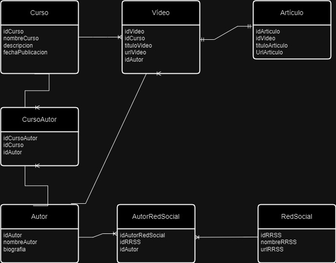

# 06-Entrega-Modelado-Relacional

## Caso Básico

Para los requisitos del caso básico, he planteado el siguiente modelo:

· La tabla Curso tiene cuatro campos (idCurso, nombreCurso, descripcion y fechaPublicacion) y tiene una relación de uno a muchos con la entidad Vídeos. Un curso puede tener muchos vídeos pero un vídeo puede pertenecer a un solo curso.

· La tabla Vídeo tiene cinco campos (idVideo, idCurso, tituloVideo, urlVideo, idAutor) y una relación de uno a uno con los artículos. Entiendo que cada vídeo tiene siempre un artículo, y un artículo sólo puede ir acompañando a un vídeo.

· La tabla Artículo tiene cuatro campos (idArticulo, idVideo, tituloArticulo, urlArticulo).

· La relación entre Curso y Autor es de muchos a muchos, ya que un curso puede tener muchos autores y un autor puede tener muchos cursos. Por eso, es necesario crear una tabla intermedia que se llame CursoAutor.

· La tabla CursoAutor tiene tres campos (idCursoAutor, idCurso y idAutor). Tiene una relación de muchos a uno con la tabla Curso (un curso puede tener muchos autores) y una relación de muchos a uno con la tabla Autor (un autor puede tener muchos cursos).

· La tabla Autor tiene tres campos (idAutor, nombreAutor y biografia). 

· La relación entre la tabla Autor y la tabla RedSocial es de muchos a muchos, ya que un autor puede tener muchas redes sociales y una red social puede tener muchos autores. De nuevo, es necesario la creación de una tabla intermedia, en este caso, la tabla AutorRedSocial.

· La tabla AutorRedSocial tiene tres campos (idAutorRedSocial, idAutor y idRRSS) y una relación de muchos a uno con la tabla Autor (una red social puede tener muchos autores) y de muchos a uno con la tabla RedSocial (un autor puede tener muchas redes sociales).

· La tabla RedSocial tiene tres campos (idRRSS, nombreRRSS, urlRRSS).

· Existe una relación uno a muchos entre la tabla Autor y la tabla Video. Un autor puede tener muchos vídeos pero un vídeo sólo puede tener un autor.